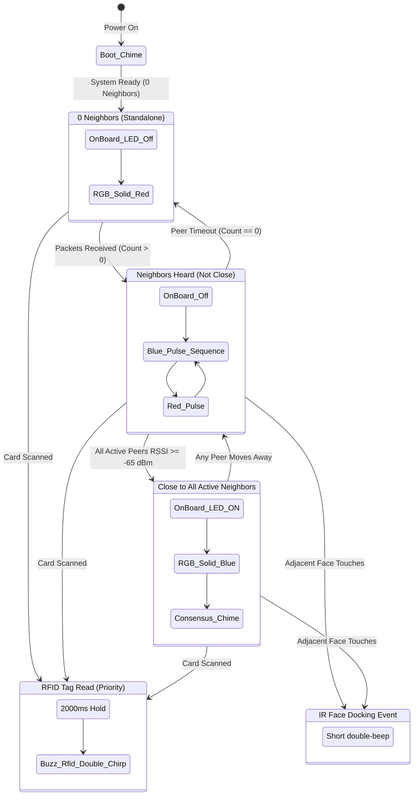

# Multi-Agent Microbots (Smart Bricks) — Instructions & Wiring Guide

This document provides complete instructions for wiring, configuring, flashing, testing, and expanding the **Multi-Agent Smart Bricks** system using **ESP32 Dev Modules** (compatible with both 30-pin and 38-pin boards), **MFRC522 RFID Readers**, **Common-Cathode RGB LEDs**, **4-Face Directional IR Sensors**, and an **Audio Buzzer**.

> [!NOTE]
> **30-Pin Board Pinout Optimization**: All GPIO pins in this firmware are strictly **$\le 35$**. Many popular 30-pin ESP32 boards (e.g., DevKit V1, NodeMCU-32S 30-pin) omit GPIO 36 (VP) and GPIO 39 (VN) or lack breakout pins for them. This pinout is 100% compatible with all standard 30-pin and 38-pin ESP32 modules.

---

## 📋 Table of Contents
1. [System Architecture Overview](#1-system-architecture-overview)
2. [Hardware Connections & Complete Pinout](#2-hardware-connections--complete-pinout)
   - [A. MFRC522 RFID Reader](#a-mfrc522-rfid-reader-spi--vspi)
   - [B. Common-Cathode RGB LED](#b-common-cathode-rgb-led)
   - [C. On-Board Status LED](#c-on-board-status-led)
   - [D. 4-Face Directional IR Sensors](#d-4-face-directional-ir-sensors-north-east-south-west)
   - [E. Audio Buzzer](#e-audio-buzzer-active--passive)
   - [F. Full Circuit Schematic & Breadboard Diagram](#f-full-circuit-schematic--breadboard-diagram)
3. [Future Expansion Hardware (Remaining Roadmap)](#3-future-expansion-hardware-remaining-roadmap)
4. [Firmware Configuration & Flashing Guide](#4-firmware-configuration--flashing-guide)
5. [Operational State Machine, LED & Buzzer Legend](#5-operational-state-machine-led--buzzer-legend)
6. [ESP-NOW Communication Protocol](#6-esp-now-communication-protocol)
7. [Testing & Verification Procedures](#7-testing--verification-procedures)
8. [Troubleshooting & Calibration](#8-troubleshooting--calibration)

---

## 1. System Architecture Overview

The Multi-Agent Smart Brick system consists of **4 autonomous ESP32 microbots** ("bricks"). Each brick operates independently without any central broker, router, or master controller:
- **Peer-to-Peer ESP-NOW Wireless**: Nodes communicate over 2.4 GHz raw radio frames, broadcasting their identity and active neighbor count.
- **Proximity Sensing via RSSI**: Each node measures incoming radio signal strength (RSSI), smooths it through an Exponential Moving Average (EMA) filter, and applies hysteresis to classify neighbors as "CLOSE" or "FAR".
- **4-Face Physical Docking Detection (IR)**: Each brick is equipped with 4 directional IR obstacle/proximity sensors positioned along its cardinal faces:
  - **NORTH**: `GPIO 34` (D34)
  - **EAST**: `GPIO 35` (D35)
  - **SOUTH**: `GPIO 32` (D32)
  - **WEST**: `GPIO 33` (D33)
- **Acoustic Feedback (Buzzer)**: Driven on **`GPIO 27`** (D27) to provide distinct audible tones for RFID tag confirmation, physical face docking/undocking, proximity consensus, and boot status.
- **Dual Visual Indicators**:
  - **On-Board LED (`GPIO 2`)**: Lights up when the brick is in close physical proximity to all its active neighbors.
  - **External RGB LED (`GPIO 16, 17, 25`)**:
    - Lights **Green** when an RFID card/tag from a neighbor is scanned.
    - Otherwise sequences **Blue then Red in order of neighbor count** (or **Solid Red** when standalone with 0 neighbors).
- **RFID Presence Detection**: Uses the SPI-based MFRC522 reader to identify neighbor tokens or docked instruments.

---

## 2. Hardware Connections & Complete Pinout

Each of the 4 bricks has an **identical** hardware connection layout using pins strictly $\le 35$:

### A. MFRC522 RFID Reader (SPI / VSPI)

| MFRC522 Pin | ESP32 Pin | Label on Board | Description / Notes |
| :--- | :--- | :--- | :--- |
| **3.3V / VCC** | `3V3` | `3V3` | **Must be 3.3V** (Do NOT connect to 5V/VIN; damages RFID chip) |
| **RST** | `GPIO 4` | `D4` | Reset Control Pin |
| **GND** | `GND` | `GND` | Ground reference |
| **IRQ** | *NC* | *NC* | Not connected |
| **MISO** | `GPIO 19` | `D19` | Standard VSPI MISO |
| **MOSI** | `GPIO 23` | `D23` | Standard VSPI MOSI |
| **SCK** | `GPIO 18` | `D18` | Standard VSPI Clock |
| **SDA / SS** | `GPIO 5` | `D5` | SPI Slave Select / Chip Select |

---

### B. Common-Cathode RGB LED

> [!IMPORTANT]
> Always insert a **220Ω to 330Ω current-limiting resistor** in series with each color anode (Red, Green, Blue) to prevent pin overload and ensure balanced brightness.

| RGB LED Pin | Series Resistor | ESP32 Pin | Label on Board | Logic State |
| :--- | :--- | :--- | :--- | :--- |
| **RED Anode** | 220Ω | `GPIO 16` | `D16` / `RX2` | `HIGH` = Red ON |
| **GREEN Anode** | 220Ω | `GPIO 17` | `D17` / `TX2` | `HIGH` = Green ON |
| **BLUE Anode** | 220Ω | `GPIO 25` | `D25` | `HIGH` = Blue ON |
| **Common Cathode (Longest pin)** | Direct | `GND` | `GND` | Common ground |

---

### C. On-Board Status LED

| Indicator | ESP32 Pin | Logic State | Function |
| :--- | :--- | :--- | :--- |
| **On-Board LED** | `GPIO 2` | `HIGH` = ON | Built-in blue LED; illuminates when **close to all active neighbors** |

---

### D. 4-Face Directional IR Sensors (North, East, South, West)

Standard 3-pin IR obstacle avoidance / proximity modules (e.g., FC-51, TCRT5000, or KY-032) feature `VCC`, `GND`, and `OUT`. All 4 inputs are conveniently placed on 4 adjacent pins on the left side of the ESP32 (`D34`, `D35`, `D32`, `D33`):

| IR Sensor Position | Sensor Pin | ESP32 Pin | Label on Board | Notes & Characteristics |
| :--- | :--- | :--- | :--- | :--- |
| **NORTH Face (Top)** | VCC | `3V3` | `3V3` | Shared 3.3V power bus |
| | GND | `GND` | `GND` | Common ground |
| | OUT | `GPIO 34` | **`D34`** | Input-only GPIO (GPI) |
| **EAST Face (Right)** | VCC | `3V3` | `3V3` | Shared 3.3V power bus |
| | GND | `GND` | `GND` | Common ground |
| | OUT | `GPIO 35` | **`D35`** | Input-only GPIO (GPI) |
| **SOUTH Face (Bottom)** | VCC | `3V3` | `3V3` | Shared 3.3V power bus |
| | GND | `GND` | `GND` | Common ground |
| | OUT | `GPIO 32` | **`D32`** | General-Purpose I/O |
| **WEST Face (Left)** | VCC | `3V3` | `3V3` | Shared 3.3V power bus |
| | GND | `GND` | `GND` | Common ground |
| | OUT | `GPIO 33` | **`D33`** | General-Purpose I/O |

> [!TIP]
> **IR Calibration**: Each IR module has a small onboard potentiometer. Turn it until the module's detection indicator LED turns ON when an adjacent brick face is placed **2 cm to 4 cm** away, and turns OFF when separated. Standard modules are **Active LOW** (output 0V when face is detected), which matches `#define IR_ACTIVE_LOW true` in `brick.ino`.

---

### E. Audio Buzzer (Active / Passive)

| Buzzer Type | Buzzer Pin | ESP32 Pin | Label on Board | Notes |
| :--- | :--- | :--- | :--- | :--- |
| **2-Pin Active Buzzer** | Positive (+) / Long Pin | `GPIO 27` | **`D27`** | Directly driven (or add 100Ω if too loud) |
| | Negative (-) / Short Pin | `GND` | `GND` | Common ground |
| **3-Pin Buzzer Module** | I/O / SIG | `GPIO 27` | **`D27`** | Digital trigger signal |
| | VCC | `3V3` or `5V` | `3V3` | Module power |
| | GND | `GND` | `GND` | Common ground |

---

### F. Full Circuit Schematic & Breadboard Diagram

```
                             +-----------------------------+
                             |       ESP32 Dev Module      |
                             |       (30-Pin DevKit V1)    |
            +3.3V <----------| 3V3                     GND |----------> GND (Common)
         RFID RST <----------| GPIO 4              GPIO 23 |----------> RFID MOSI
          RFID SS <----------| GPIO 5              GPIO 19 |----------> RFID MISO
         RGB-RED  <--[220Ω]--| GPIO 16             GPIO 18 |----------> RFID SCK
         RGB-GRN  <--[220Ω]--| GPIO 17              GPIO 2 |----------> [On-Board Blue LED]
         RGB-BLU  <--[220Ω]--| GPIO 25             GPIO 27 |----------> BUZZER (+)
   [Future Vibrator Motor] <-| GPIO 26             GPIO 33 |<---------- IR WEST  (OUT)
      [Future IMU SDA] <-----| GPIO 21             GPIO 32 |<---------- IR SOUTH (OUT)
      [Future IMU SCL] <-----| GPIO 22             GPIO 35 |<---------- IR EAST  (OUT)
                             |                     GPIO 34 |<---------- IR NORTH (OUT)
                             +-----------------------------+
```

---

## 3. Future Expansion Hardware (Remaining Roadmap)

The following GPIO pins remain reserved and stubbed in [`brick.ino`](brick.ino) for subsequent development milestones (all $\le 35$):

| Module / Function | ESP32 Pin | Label | Direction | Notes |
| :--- | :--- | :--- | :--- | :--- |
| **IMU / Mag I2C SDA** | `GPIO 21` | `D21` | Bidirectional | Standard I2C Data (MPU6050, MPU9250, QMC5883L) |
| **IMU / Mag I2C SCL** | `GPIO 22` | `D22` | Bidirectional | Standard I2C Clock |
| **Vibrator Motor** | `GPIO 26` | `D26` | Output | Drives NPN transistor (2N2222) / MOSFET gate |

---

## 4. Firmware Configuration & Flashing Guide

### Step 1: Install Required Libraries
Open the **Arduino IDE** (or `arduino-cli`):
1. Navigate to **Tools > Manage Libraries...**
2. Search for `MFRC522` (by *GithubCommunity* / *miguelbalboa*).
3. Click **Install**.

### Step 2: Open the Sketch
Open [`Code/brick.ino`](brick.ino) or [`Code/brick/brick.ino`](brick/brick.ino).

### Step 3: Configure `BRICK_ID` for Each Board
At the top of [`brick.ino`](brick.ino), adjust line 35:

```cpp
// Flash Board 1:
#define BRICK_ID 1

// Flash Board 2:
#define BRICK_ID 2

// Flash Board 3:
#define BRICK_ID 3

// Flash Board 4:
#define BRICK_ID 4
```

> [!NOTE]
> Ensure `WIFI_CHANNEL` is set to `1` (or matching channel) across all 4 bricks.

### Step 4: Flash the Board
1. Connect the ESP32 to your PC via Micro-USB.
2. Under **Tools > Board**, select `ESP32 Dev Module`.
3. Under **Tools > Port**, select the respective COM/tty port (e.g. `/dev/ttyUSB0`).
4. Click **Upload**.
5. Repeat for all 4 ESP32 modules.

---

## 5. Operational State Machine, LED & Buzzer Legend



### Complete Sensory Indicator Reference

| Event / Condition | On-Board LED (`GPIO 2`) | External RGB LED (`GPIO 16, 17, 25`) | Audio Buzzer (`GPIO 27`) |
| :--- | :---: | :--- | :--- |
| **System Boot** | Pulse | Flashes Red | 🎵 Triple startup chime |
| **RFID Tag Scanned** | Normal | 🟢 **Solid GREEN** (2.0s hold) | 🔔 Cheerful double-chirp (60ms + 100ms) |
| **IR Face Docks** | Normal | Normal | 🔔 Ascending double-beep (40ms + 80ms) |
| **IR Face Undocks** | Normal | Normal | ⚠️ Single alert tone (120ms) |
| **Close to All Neighbors** | 💡 **Solid ON** | 🔵 **Solid BLUE** | 🔔 Consensus chime on entry |
| **0 Neighbors (Standalone)** | ⚫ OFF | 🔴 **Solid RED** | Silent |
| **1 Neighbor (Not Close)** | ⚫ OFF | 🔵 **1 Blue Pulse** ➔ 🔴 **1 Red Pulse** | Silent |
| **2 Neighbors (Not Close)** | ⚫ OFF | 🔵 **2 Blue Pulses** ➔ 🔴 **1 Red Pulse** | Silent |
| **3 Neighbors (Not Close)** | ⚫ OFF | 🔵 **3 Blue Pulses** ➔ 🔴 **1 Red Pulse** | Silent |

---

## 6. ESP-NOW Communication Protocol

### Packet Format
To keep radio overhead minimal and transmission lightning fast, bricks exchange a packed 2-byte structure:

```cpp
typedef struct __attribute__((packed)) {
  uint8_t sender_id;       // Brick ID (1..4)
  uint8_t neighbor_count;  // Number of active neighbors currently heard by sender
} BrickPacket;
```

### Proximity Estimation Algorithm
1. **Raw Reading**: Received packet signal level extracted via `info->rx_ctrl->rssi`.
2. **Exponential Moving Average Filter**:
   $$\text{RSSI}_{\text{ema}} = \alpha \cdot \text{RSSI}_{\text{raw}} + (1 - \alpha) \cdot \text{RSSI}_{\text{prev}}$$
   (with $\alpha = 0.30$).
3. **Schmitt Trigger Hysteresis**:
   - Transition to `CLOSE` when $\text{RSSI}_{\text{ema}} \ge -65\text{ dBm}$.
   - Transition to `FAR` when $\text{RSSI}_{\text{ema}} < -69\text{ dBm}$ (with $4\text{ dB}$ hysteresis margin).
4. **Neighbor Aging**: If no packet is received from a peer within $2500\text{ ms}$, it is marked offline.

---

## 7. Testing & Verification Procedures

### Step-by-Step Verification
1. **Power Up Single Brick (Brick 1)**:
   - Buzzer: Plays startup melodic chime on `GPIO 27`.
   - On-Board LED: **OFF**.
   - RGB LED: **Solid RED** (0 neighbors).
   - Serial Monitor prints:
     ```text
     BRICK #1 | Active Neighbors: 0 | Close To All: NO | On-Board LED: OFF
     IR Faces Docked (0/4): [N:-- E:-- S:-- W:--]
     RGB LED State: [SOLID RED] (0 Neighbors)
     ```
2. **Test 4-Face IR Sensors**:
   - Bring an obstacle / second brick face close to the **North IR sensor** (`GPIO 34`).
   - Buzzer sounds a crisp ascending double-beep (`buzzDockChime`).
   - Serial Monitor prints: `[IR] >>> FACE DOCKED: NORTH face detected adjacent brick! <<<`.
   - Remove obstacle: buzzer emits a short alert tone (`buzzUndockChime`) and logs undocking.
   - Repeat for **East (`GPIO 35`)**, **South (`GPIO 32`)**, and **West (`GPIO 33`)**.
3. **Power Up Brick 2 at a Distance (> 2 meters)**:
   - Both bricks detect each other wirelessly.
   - Neighbor count = 1 on both.
   - On-Board LED: **OFF**.
   - RGB LED: **1 Blue flash, then 1 Red flash, then pause** (repeating).
4. **Bring Brick 2 Close to Brick 1 (< 10 cm)**:
   - RSSI increases above $-65\text{ dBm}$.
   - Buzzer sounds consensus chime on entry.
   - On-Board LED: **Turns ON** on both bricks.
   - RGB LED: **Turns Solid BLUE**.
5. **Scan an RFID Tag on Brick 1**:
   - Buzzer immediately plays a cheerful double-chirp (`buzzRfidSuccess`).
   - RGB LED immediately turns **Solid GREEN** for 2.0 seconds.
   - Serial Monitor prints: `[RFID] Card Detected! UID: ... Lighting Green LED`.
   - After 2.0s, RGB LED resumes the appropriate swarm pattern.

---

## 8. Troubleshooting & Calibration

- **IR Sensor Always Detected / Never Detected**:
  - Adjust the small trimmer potentiometer on the IR module with a small screwdriver.
  - Set the threshold so the indicator LED on the sensor lights up only when a brick or hand is within 2–5 cm.
- **Buzzer Is Silent**:
  - Check polarity: long lead goes to `GPIO 27` (D27), short lead to `GND`.
  - Ensure `#define BUZZER_ENABLED true` is set in `brick.ino`.
- **RFID Version Reads 0x00 or 0xFF**:
  - Check SPI wiring: `MOSI=GPIO 23`, `MISO=GPIO 19`, `SCK=GPIO 18`, `SS=GPIO 5`, `RST=GPIO 4`.
  - Ensure the reader is powered by **3.3V**, NOT 5V.
