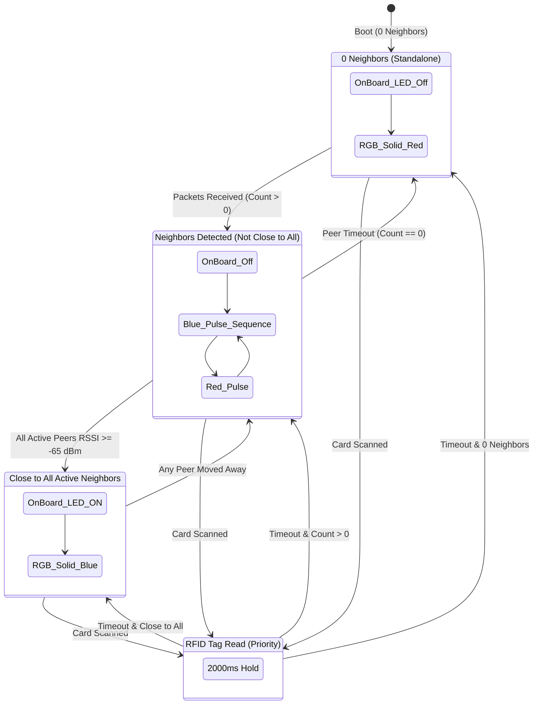

# Multi-Agent Microbots (Smart Bricks) — Instructions & Wiring Guide

This document provides complete instructions for wiring, configuring, flashing, testing, and expanding the **Multi-Agent Smart Bricks** system using **ESP32 Dev Modules**, **MFRC522 RFID Readers**, and **Common-Cathode RGB LEDs**.

---

## 📋 Table of Contents
1. [System Architecture Overview](#1-system-architecture-overview)
2. [Hardware Connections & Pinout](#2-hardware-connections--pinout)
3. [Future Expansion Hardware (TODO Pins)](#3-future-expansion-hardware-todo-pins)
4. [Firmware Configuration & Flashing Guide](#4-firmware-configuration--flashing-guide)
5. [Operational State Machine & LED Color Legend](#5-operational-state-machine--led-color-legend)
6. [ESP-NOW Communication Protocol](#6-esp-now-communication-protocol)
7. [Testing & Verification Procedures](#7-testing--verification-procedures)
8. [Future Roadmap & Implementation Stubs](#8-future-roadmap--implementation-stubs)

---

## 1. System Architecture Overview

The Multi-Agent Smart Brick system consists of **4 autonomous ESP32 microbots** ("bricks"). Each brick operates independently without any central broker, router, or master controller:
- **Peer-to-Peer ESP-NOW Wireless**: Nodes communicate over 2.4 GHz raw radio frames, broadcasting their identity and active neighbor count.
- **Proximity Sensing via RSSI**: Each node measures incoming radio signal strength (RSSI), smooths it through an Exponential Moving Average (EMA) filter, and applies hysteresis to classify neighbors as "CLOSE" or "FAR".
- **Dual Visual Indicators**:
  - **On-Board LED (`GPIO 2`)**: Lights up when the brick is in close physical proximity to all its active neighbors.
  - **External RGB LED (`GPIO 16, 17, 25`)**:
    - Lights **Green** when an RFID card/tag from a neighbor is scanned.
    - Otherwise sequences **Blue then Red in order of neighbor count** (or **Solid Red** when standalone with 0 neighbors).
- **RFID Presence Detection**: Uses the SPI-based MFRC522 reader to identify neighbor tokens or docked instruments.

---

## 2. Hardware Connections & Pinout

Each of the 4 bricks has an **identical** hardware connection layout:

### A. MFRC522 RFID Reader (SPI / VSPI)

| MFRC522 Pin | ESP32 GPIO | Description / Notes |
| :--- | :--- | :--- |
| **3.3V / VCC** | `3V3` | **Must be 3.3V** (Do NOT connect to 5V; damages RFID chip) |
| **RST** | `GPIO 4` | Reset Control Pin |
| **GND** | `GND` | Ground reference |
| **IRQ** | *NC* | Not connected |
| **MISO** | `GPIO 19` | Standard VSPI MISO |
| **MOSI** | `GPIO 23` | Standard VSPI MOSI |
| **SCK** | `GPIO 18` | Standard VSPI Clock |
| **SDA / SS** | `GPIO 5` | SPI Slave Select / Chip Select |

### B. Common-Cathode RGB LED

> [!IMPORTANT]
> Always insert a **220Ω to 330Ω current-limiting resistor** in series with each color anode (Red, Green, Blue) to prevent pin overload and ensure balanced brightness.

| RGB LED Pin | Series Resistor | ESP32 GPIO | Logic State |
| :--- | :--- | :--- | :--- |
| **RED Anode** | 220Ω | `GPIO 16` | `HIGH` = Red ON |
| **GREEN Anode** | 220Ω | `GPIO 17` | `HIGH` = Green ON |
| **BLUE Anode** | 220Ω | `GPIO 25` | `HIGH` = Blue ON |
| **Common Cathode (Longest pin)** | Direct | `GND` | Common ground |

### C. On-Board Status LED

| Indicator | ESP32 GPIO | Logic State | Function |
| :--- | :--- | :--- | :--- |
| **On-Board LED** | `GPIO 2` | `HIGH` = ON | Illuminates when **close to all active neighbors** |

---

### D. Wiring Schematic (Breadboard View)

```
                       +-----------------------------+
                       |       ESP32 Dev Module      |
                       |                             |
      +3.3V <----------| 3V3                     GND |----------> GND (Common)
   RFID RST <----------| GPIO 4              GPIO 23 |----------> RFID MOSI
    RFID SS <----------| GPIO 5              GPIO 19 |----------> RFID MISO
   RGB-RED  <--[220Ω]--| GPIO 16             GPIO 18 |----------> RFID SCK
   RGB-GRN  <--[220Ω]--| GPIO 17              GPIO 5 |----------> RFID SDA/SS
   RGB-BLU  <--[220Ω]--| GPIO 25              GPIO 2 |----------> [On-Board Blue LED]
                       +-----------------------------+
```

---

## 3. Future Expansion Hardware (TODO Pins)

The following GPIO pins are reserved and already defined in [`brick.ino`](brick.ino) for upcoming hardware additions:

| Module / Function | ESP32 GPIO | Direction | Notes |
| :--- | :--- | :--- | :--- |
| **IR North Receiver** | `GPIO 34` | Input | Input-only GPIO (ideal for 38kHz active-low IR demodulator) |
| **IR East Receiver** | `GPIO 35` | Input | Input-only GPIO |
| **IR South Receiver** | `GPIO 36` | Input | Input-only GPIO (Sensor VP) |
| **IR West Receiver** | `GPIO 39` | Input | Input-only GPIO (Sensor VN) |
| **IMU / Mag I2C SDA** | `GPIO 21` | Bidirectional | Standard I2C Data (for MPU6050, MPU9250, QMC5883L) |
| **IMU / Mag I2C SCL** | `GPIO 22` | Bidirectional | Standard I2C Clock |
| **Vibrator Motor** | `GPIO 32` | Output | Drives NPN transistor (2N2222) / N-channel MOSFET gate |

---

## 4. Firmware Configuration & Flashing Guide

### Step 1: Install Required Libraries
Open the **Arduino IDE** (or `arduino-cli`):
1. Navigate to **Tools > Manage Libraries...**
2. Search for `MFRC522` (by *GithubCommunity* / *miguelbalboa*).
3. Click **Install**.

### Step 2: Open the Sketch
Open [`Code/brick.ino`](brick.ino) or [`Code/brick/brick.ino`](brick/brick.ino).

### Step 3: Configure `BRICK_ID` for Each Board
At the top of [`brick.ino`](brick.ino), adjust line 32:

```cpp
// Flash Board 1:
#define BRICK_ID 1

// Flash Board 2:
#define BRICK_ID 2

// Flash Board 3:
#define BRICK_ID 3

// Flash Board 4:
#define BRICK_ID 4
```

> [!NOTE]
> Ensure `WIFI_CHANNEL` is set to `1` (or matching channel) across all 4 bricks.

### Step 4: Flash the Board
1. Connect the ESP32 to your PC via Micro-USB.
2. Under **Tools > Board**, select `ESP32 Dev Module`.
3. Under **Tools > Port**, select the respective COM/tty port (e.g. `/dev/ttyUSB0`).
4. Click **Upload**.
5. Repeat for all 4 ESP32 modules.

---

## 5. Operational State Machine & LED Color Legend



### Visual Summary

| Hardware Indicator | Condition / Swarm State | Visual Appearance |
| :--- | :--- | :--- |
| **On-Board LED** | Close to **all** active neighbors | 💡 **Solid ON** |
| **On-Board LED** | Far from any neighbor OR isolated | ⚫ **OFF** |
| **External RGB LED** | RFID Card/Tag of a neighbor scanned | 🟢 **Solid GREEN** (for 2.0 seconds) |
| **External RGB LED** | 0 active neighbors detected | 🔴 **Solid RED** (Standalone) |
| **External RGB LED** | 1 active neighbor (not close) | 🔵 **1 Blue Pulse** ➔ 🔴 **1 Red Pulse** ➔ Pause |
| **External RGB LED** | 2 active neighbors (not close) | 🔵 **2 Blue Pulses** ➔ 🔴 **1 Red Pulse** ➔ Pause |
| **External RGB LED** | 3 active neighbors (not close) | 🔵 **3 Blue Pulses** ➔ 🔴 **1 Red Pulse** ➔ Pause |
| **External RGB LED** | Close to all active neighbors | 🔵 **Solid BLUE** (Docked / aligned) |

---

## 6. ESP-NOW Communication Protocol

### Packet Format
To keep radio overhead minimal and transmission lightning fast, bricks exchange a packed 2-byte structure:

```cpp
typedef struct __attribute__((packed)) {
  uint8_t sender_id;       // Brick ID (1..4)
  uint8_t neighbor_count;  // Number of active neighbors currently heard by sender
} BrickPacket;
```

### Proximity Estimation Algorithm
1. **Raw Reading**: Received packet signal level extracted via `info->rx_ctrl->rssi`.
2. **Exponential Moving Average Filter**:
   $$\text{RSSI}_{\text{ema}} = \alpha \cdot \text{RSSI}_{\text{raw}} + (1 - \alpha) \cdot \text{RSSI}_{\text{prev}}$$
   (with $\alpha = 0.30$).
3. **Schmitt Trigger Hysteresis**:
   - Transition to `CLOSE` when $\text{RSSI}_{\text{ema}} \ge -65\text{ dBm}$.
   - Transition to `FAR` when $\text{RSSI}_{\text{ema}} < -69\text{ dBm}$ (with $4\text{ dB}$ hysteresis margin).
4. **Neighbor Aging**: If no packet is received from a peer within $2500\text{ ms}$, it is marked offline.

---

## 7. Testing & Verification Procedures

### Step-by-Step Verification
1. **Power Up Single Brick (Brick 1)**:
   - On-Board LED: **OFF**
   - RGB LED: **Solid RED** (0 neighbors).
   - Serial Monitor shows: `BRICK #1 | Neighbors: 0 | Close To All: NO | On-Board LED: OFF`.
2. **Power Up Brick 2 at a Distance (> 2 meters)**:
   - Both bricks detect each other wirelessly.
   - Neighbor count = 1 on both.
   - On-Board LED: **OFF**.
   - RGB LED: **1 Blue flash, then 1 Red flash, then pause** (repeating).
3. **Bring Brick 2 Close to Brick 1 (< 10 cm)**:
   - RSSI increases above $-65\text{ dBm}$.
   - On-Board LED: **Turns ON** on both bricks.
   - RGB LED: **Turns Solid BLUE**.
4. **Introduce Brick 3 and Brick 4**:
   - Observe neighbor counts incrementing to 2 and 3.
   - Notice the RGB LED pulses Blue 2 times or 3 times before pulsing Red.
   - Move all 4 bricks together: all 4 On-Board LEDs illuminate!
5. **Scan an RFID Tag on Brick 1**:
   - RGB LED immediately turns **Solid GREEN** for 2.0 seconds.
   - Serial Monitor prints: `[RFID] Card Detected! UID: ... Lighting Green LED`.
   - After 2.0s, RGB LED resumes the appropriate Blue/Red swarm pattern.

---

## 8. Future Roadmap & Implementation Stubs

In [`brick.ino`](brick.ino), modular hooks have been prepared for the upcoming microbot capabilities:

1. **Directional IR Proximity & Mating**:
   - 4 IR phototransistors placed along the North, East, South, and West faces (`GPIO 34, 35, 36, 39`).
   - Enables microbots to know not just that a neighbor is near, but *which face* is docking.
2. **IMU + Magnetometer (9-DoF Orientation)**:
   - Connected via I2C (`GPIO 21 SDA, GPIO 22 SCL`).
   - Calculates absolute orientation relative to Magnetic North. Microbots can align their heading or detect tilt and motion.
3. **Haptic Vibrator Motor Actuator**:
   - Controlled via `GPIO 32` through a transistor driver.
   - Provides tactile feedback when a microbot docks with a peer or scans an RFID instrument.
